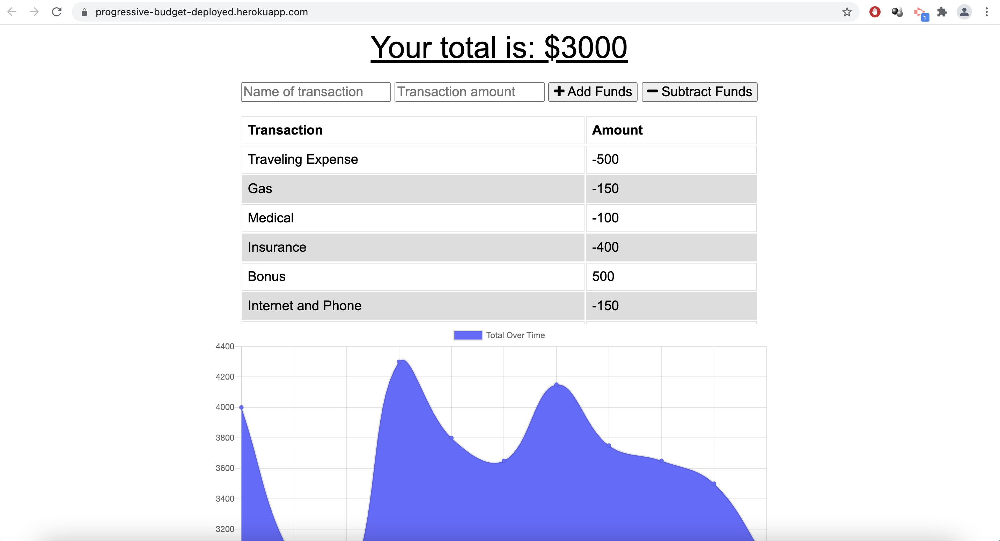
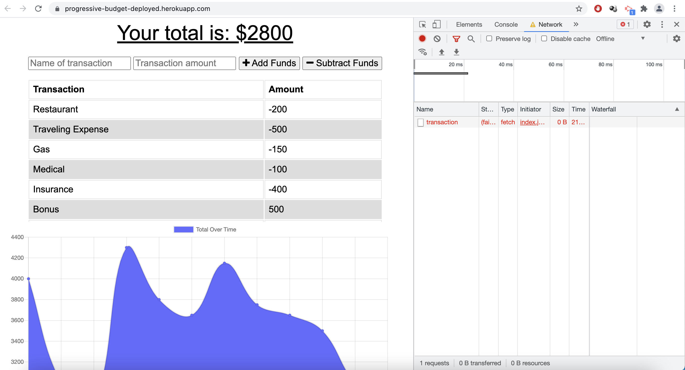

# progressive-budget


[](https://opensource.org/licenses/MIT)


## Table of Contents
- [Description](#Description)
- [Screenshots](#Screenshots)
- [User Story](#User-Story)
- [Acceptance Criteria](#Acceptance-Criteria)
- [Deployed Application URL](#Deployed-Application-URL)


## Description 


## Screenshots




## User Story 
```
AS AN avid traveller
I WANT to be able to track my withdrawals and deposits with or without a data/internet connection
SO THAT my account balance is accurate when I am traveling
```


## Acceptance Criteria
```
GIVEN a user is on Budget App without an internet connection
WHEN the user inputs a withdrawal or deposit
THEN that will be shown on the page, and added to their transaction history when their connection is back online.
```


## Deployed Application URL 
[Progressive Budget](https://progressive-budget-deployed.herokuapp.com/)